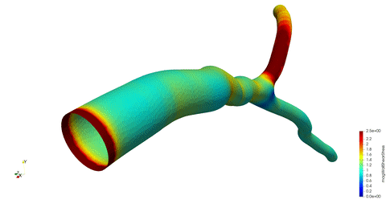
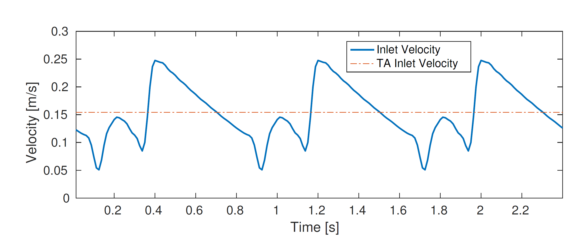

# Artery Scaling Law Boundary Conditions




Scaling law boundary conditions for OpenFoam 2.1.1 based off the paper
[Functional and anatomical measures for outflow boundary conditions in atherosclerotic coronary bifurcations](https://www.researchgate.net/publication/285045581_Functional_and_anatomical_measures_for_outflow_boundary_conditions_in_atherosclerotic_coronary_bifurcations).

A representative inlet flow rate for a case can be found by using a diameter flow
relation,


For two diameters a scaling law for the set of outflow ratios can be used


Using mass conservation we know that


Thus,


and,


Thus we can build our boundary conditions to satisfy the above equations.
The boundary conditions have been made for both steady and pulsatile conditions.
When the flow is pulsatile a pulsatile inlet velocity waveform is used which is
consistent with in vivo physiological conditions (i.e. human
heartbeat).




## Building the Boundary Conditions

To install all boundary conditions source the OpenFOAM 2.1.1 .bashrc and run

``` shell
# Download the github repository
git clone https://github.com/Chr1sC0de/ArteryScalingLawsBC.git
# Provide permission to all the ./Allwmake and ./Allwclean files
chmod -R +x ArteryScalingLawsBC
cd  ArteryScalingLawsBC
# Install the boundary conditions
./Allwmake
```

## Running Examples

To run a single example on the gadi super computer

``` shell
cd examples/<case_folder>
qsub openfoam_job.sh
```

To change the number of processors used for all cases

``` shell
cd examples
# The following code will change the ncpus variable in the openfoam_job.sh
# As well as the numberOfSubdomains in the systems/decomposeParDict file
./change_ncpus.sh -n <number of cpus>
```

## Cleaning the Boundary Conditions

To uninstall all the boundary conditions

``` shell
cd  ArteryScalingLawsBC
./Allwclean
```

## Example U File

The following shows how the pulsatile boundary conditions can be implemented within a U file

``` c++

/*--------------------------------*- C++ -*----------------------------------*\
| =========                 |                                                 |
| \\      /  F ield         | OpenFOAM: The Open Source CFD Toolbox           |
|  \\    /   O peration     | Version:  2.1.1                                 |
|   \\  /    A nd           | Web:      www.OpenFOAM.org                      |
|    \\/     M anipulation  |                                                 |
\*---------------------------------------------------------------------------*/
FoamFile
{
    version     2.0;
    format      ascii;
    class       volVectorField;
    object      U;
}
// * * * * * * * * * * * * * * * * * * * * * * * * * * * * * * * * * * * * * //

dimensions      [0 1 -1 0 0 0 0];

internalField   uniform (0 0 0);

boundaryField
{
    WALL
    {
        type            fixedValue;
        value           uniform (0 0 0);
    }


	INLET
	{
        // if steady use arterySteadyScalingLawInlet
		type     arteryPulsatileScalingLawInlet;
        switchOn 0.2; // Time to wait before activating the pulsatile flow
        cardiacCycle 0.8;
	}

    OUTLET_1
    {
        type           arteryScalingLawOutlet;
        //NOTE: only necessary if we change the inlet patch name,
        inletPatchName INLET;
        //NOTE: only necessary if we change the outlet patch name,
        oppositeOutletPatchName OUTLET_2;
    }

    OUTLET_2
    {
        type            zeroGradient;
    }
}

// ************************************************************************* //
```